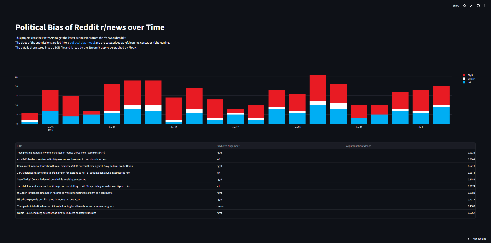

# Streamlit LLM
This is a project that aims to analyze news posts from a social media source (in this case Reddit), and identify the political alignment of them in order to identify trends.

# Example Result
The Streamlit app is available [here](https://ishan-karmakar-streamlit-llm-reader-jbqbat.streamlit.app/).

# Technologies
This project is made with Python, and uses the [PRAW](https://github.com/praw-dev/praw) API to get the news posts from r/news. To identify the political alignment, the project interfaces with [KoboldCpp](https://github.com/LostRuins/koboldcpp) (running Meta Llama 3 8B Instruct) to get responses from the LLM. The prompt, response, and post information is stored in a file that is used by `reader.py` later. To show the information in a nice UI, `reader.py` is a [Streamlit](https://streamlit.io/) app that displays the ratings over a bar graph and allows selections to see the exact prompt and response.

# Known Limitations
Despite my best efforts, the LLM seems to be unreliable with the ratings it gives back. For example, it may rate a heavily conservative post as neutral, or rate a neutral post as extremely liberal. There seems to be no rhyme or reason to this, but it would most likely be solved by using a dedicated political alignment model (text to number) instead of using a text to text model and extracting the number from it.
